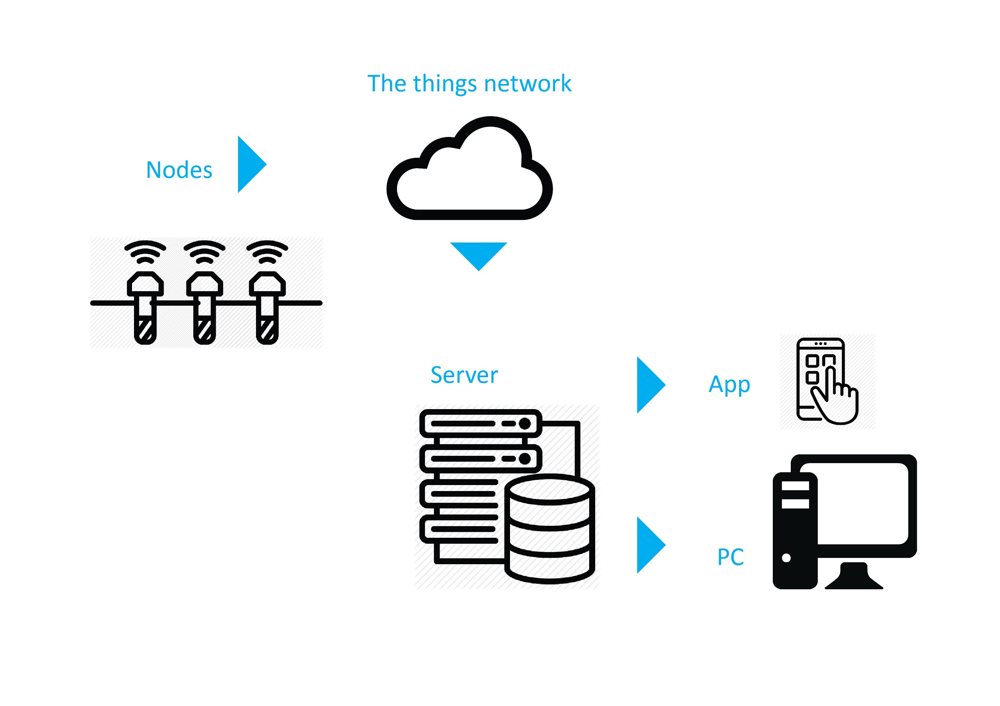

# RainDrop

Soil moisture monitoring system on LoRaWAN Network

## Problem

Resources watering city greenery are 
used sub-optimally.
It is complicated for the city to 
monitor work of subcontractors responsible
for city plants.
Rapidly changing climate makes watering an important task.

## Solution
System of wireless sensors that
measures soil moisture.

## Gains
* Municipality Gains means to evaluate work of subcontractors
* Community gains means to take care of community-planted trees
* Business gains means to optimally allocate resources 

## Architecture

## Results
* hardware prototype
* backend prototype
* cost analysis
* enduser application prototype
* all work is released under open source licence

## Plans
* order the first batch of PCBs next week
* work on battery life optimization
* deploy two LoRa gateways in next month
